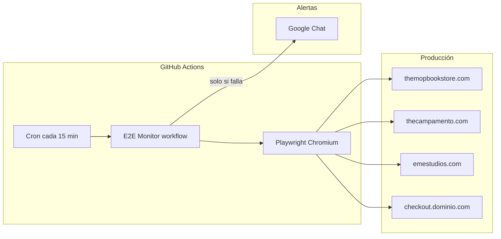

# Monitor E2E de tiendas Shopify headless

Documento para replicar el sistema de monitorización sintética en otras tiendas del mismo stack.
Pensado para CTO / responsable técnico.

**Repo de referencia:** https://github.com/casalsj/e2e-ecommerce

---

## Resumen ejecutivo

Tenemos un **monitor sintético** que simula un usuario real comprando en producción cada **15 minutos**. Si el flujo crítico se rompe, llega una alerta a un **espacio de Google Chat** del equipo.

| Aspecto | Detalle |
|---------|---------|
| **Qué se comprueba** | Home → catálogo → ficha de producto → añadir al carrito → llegar al checkout de Shopify |
| **Qué NO se hace** | No se completa el pago ni se generan pedidos |
| **Herramienta** | [Playwright](https://playwright.dev/) (Chromium headless) |
| **Ejecución** | GitHub Actions (cron + manual) |
| **Alertas** | Webhook de Google Chat Workspace |
| **Coste** | Sin servicios externos de pago (Checkly, Datadog Synthetics, etc.) |
| **Tiendas actuales** | themopbookstore.com, thecampamento.com, emestudios.com |

El código de los tests **no vive en el repo de cada tienda**. Es un repo independiente que ataca las URLs de producción como haría un cliente externo.

---

## Arquitectura



**Flujo en cada ejecución:**

1. GitHub Actions descarga el repo y ejecuta `npm test` en `mop-e2e/`.
2. Playwright lanza **12 tests** (4 por tienda × 3 tiendas).
3. Cada test abre la web en producción, acepta cookies, selecciona talla si aplica, añade producto al carrito y verifica que se llega a `checkout.{dominio}.com`.
4. Si **algún test falla**: se sube el reporte de Playwright como artefacto y se envía un `POST` al webhook de Google Chat.

---

## Estructura del repositorio

```
e2e-ecommerce/
├── .github/workflows/
│   ├── e2e.yml              # Monitor automático (cron + alerta KO)
│   └── webhook-test.yml     # Prueba manual del webhook (OK/KO por tienda)
├── GUIA-MONITOR-E2E.md      # Este documento
├── CONTEXT.md               # Contexto técnico para desarrollo
├── scripts/setup-github.sh  # Bootstrap: repo + secret + primer run
└── mop-e2e/
    ├── stores/index.js      # Configuración por tienda (rutas, selectores)
    ├── tests/
    │   ├── checkout.spec.js # Tests genéricos (mismos para todas las tiendas)
    │   └── helpers.js       # Cookies, tallas, carrito, checkout
    ├── playwright.config.js # Un proyecto Playwright por tienda
    └── package.json
```

**Principio clave:** los tests son genéricos. Toda la diferencia entre tiendas está en `stores/index.js`.

---

## Qué valida cada test (por tienda)

| # | Test | Qué comprueba |
|---|------|---------------|
| 1 | Home | La página carga, el título es correcto y la navegación principal es visible |
| 2 | Catálogo | La página de colección lista al menos un producto |
| 3 | Ficha de producto | Precio visible y botón de añadir al carrito disponible |
| 4 | **Camino crítico** | Producto fijo → carrito con el artículo → URL de checkout de Shopify |

El producto de prueba de cada tienda es **fijo y estable** (no aleatorio), definido en `productPath` dentro de `stores/index.js`.

---

## Tiendas configuradas hoy

| Tienda | Producto de prueba | Checkout | Particularidades |
|--------|-------------------|----------|------------------|
| **themopbookstore** | Annie Leibovitz book | Enlace "Continuar con el pago" | Cesta `Cesta (N)`, sin talla |
| **thecampamento** | Falling Star Sweatshirt | Botón CHECKOUT (API en CI) | Talla `7/8`, locale en-GB, popup Klaviyo |
| **emestudios** | Roots Shadow Oversized Tee | Botón PAGAR (API en CI) | Tallas M/L/S, popup newsletter |

**Checkout en CI:** en emestudios y thecampamento, el test del camino crítico usa `cart.checkoutUrl` de la API interna (`/api/shopify/cart/.../checkout`) en lugar de pulsar el botón del cajón. Es el mismo handoff a Shopify y evita popups que bloquean el clic en runners de GitHub. themopbookstore sigue el flujo UI completo.

---

## Cómo replicar en una tienda nueva

### Paso 1 — Mapear el flujo en producción (manual)

Antes de escribir código, recorrer en el navegador:

1. URL de home, catálogo y un producto estable (que no se agote).
2. Texto del banner de cookies y del botón de aceptar.
3. Si hay tallas obligatorias, cuáles están siempre disponibles.
4. Texto del botón "añadir al carrito" y del cajón de compra.
5. Cómo se llega al checkout (botón, enlace, etc.).
6. **URL final del checkout** — debe ser `checkout.{dominio}.com/checkouts/...`.

Herramienta útil para mapear selectores: `npm run test:ui` en `mop-e2e/`.

### Paso 2 — Añadir entrada en `stores/index.js`

Copiar una tienda similar y adaptar:

```javascript
nuevaTienda: {
  id: 'nuevaTienda',
  label: 'nuevatienda.com',
  baseURL: 'https://nuevatienda.com',
  locale: 'es-ES',
  productPath: '/es/producto-ejemplo',
  catalogPath: '/es/coleccion-ejemplo',
  homeTitle: /nombre tienda/i,
  homeNavLink: /colecciones/i,
  productLinkSelector: 'a[href*="/product"]',
  pricePattern: /\d+[.,]\d{2}\s*€/i,
  cookiePattern: /^aceptar$/i,
  addToCartPattern: /añadir al carrito/i,
  cartDrawerPattern: /contenido del carrito|subtotal|total/i,
  cartInDrawerPattern: /nombre del producto/i,
  checkoutUrlPattern: /checkout\.nuevatienda\.com|shopify\.com|\/checkouts?\//i,
  checkout: { type: 'button', pattern: /^pagar$/i },
  preferApiCheckout: true,  // recomendado si hay popups agresivos
  size: 'M',                // null si no aplica; array si hay fallback
},
```

Playwright crea automáticamente un proyecto por cada clave del objeto `stores` (ver `playwright.config.js`).

### Paso 3 — Validar en local

```bash
cd mop-e2e
npm install
npx playwright install chromium
npm test -- --project=nuevaTienda
```

Los 4 tests deben pasar contra **producción**.

### Paso 4 — Actualizar workflows (si aplica)

Si se usa el workflow de prueba de webhook, añadir la nueva tienda en las `options` de `store` en `.github/workflows/webhook-test.yml`.

### Paso 5 — Push y verificar CI

```bash
git push origin main
gh workflow run e2e.yml --repo ORG/e2e-ecommerce
gh run watch
```

Objetivo: todos los tests en verde en GitHub Actions (no solo en local).

### Paso 6 — Documentar

Actualizar `CONTEXT.md` con el flujo mapeado y las particularidades de la tienda.

---

## Configuración de Google Chat (alertas)

### Crear el webhook

1. Abrir el **espacio de Google Chat** donde deben llegar las alertas.
2. Nombre del espacio → **Apps e integraciones** → **Webhooks**.
3. Crear webhook (ej. "E2E Monitor").
4. Copiar la URL completa. Formato típico:
   `https://chat.googleapis.com/v1/spaces/XXXX/messages?key=...&token=...`

### Guardar el secret en GitHub

La URL **nunca** va en el código. Solo como secret del repositorio:

```bash
gh secret set GOOGLE_CHAT_WEBHOOK --body 'https://chat.googleapis.com/v1/spaces/...'
```

O desde la UI: **Settings → Secrets and variables → Actions → New repository secret**.

### Probar que funciona

**Opción A — curl local** (sustituir la URL):

```bash
curl -sf -X POST \
  -H 'Content-Type: application/json; charset=UTF-8' \
  --data '{"text":"✅ Prueba manual E2E Monitor"}' \
  "$GOOGLE_CHAT_WEBHOOK"
```

**Opción B — workflow de prueba** (recomendado, usa el secret de GitHub):

1. GitHub → **Actions** → **Webhook Test** → **Run workflow**.
2. Elegir `store` (tienda) y `outcome`:
   - **ok** → ejecuta los 4 tests reales y envía `✅ E2E OK`.
   - **ko** → envía `🚨 E2E FALLÓ` sin ejecutar tests (simulación).

Repetir para cada tienda si se quiere validar el espacio completo.

---

## Workflows de GitHub Actions

### `E2E Monitor` (`e2e.yml`) — producción

| Propiedad | Valor |
|-----------|-------|
| **Disparadores** | Cron `*/15 * * * *` (cada 15 min) + ejecución manual |
| **Qué ejecuta** | `npm test` → las 3 tiendas, 12 tests |
| **Si todo OK** | Silencio (no envía mensaje a Chat) |
| **Si falla** | Artefacto `playwright-report` + mensaje 🚨 a Google Chat |
| **Secret necesario** | `GOOGLE_CHAT_WEBHOOK` |

Mensaje de alerta actual:

```
🚨 E2E FALLÓ en monitor multi-tienda (themopbookstore / thecampamento / emestudios)
Run: https://github.com/.../actions/runs/...
```

> **Mejora pendiente:** incluir qué tienda concreta falló en el mensaje (hoy hay que abrir el run de Actions).

### `Webhook Test` (`webhook-test.yml`) — validación de alertas

Solo manual. Sirve para comprobar que el webhook y el espacio de Chat están bien configurados sin esperar un fallo real.

| `outcome` | Comportamiento |
|-----------|----------------|
| `ok` | Ejecuta tests de la tienda elegida → mensaje ✅ a Chat |
| `ko` | Mensaje 🚨 a Chat → job marcado como fallido (esperado) |

---

## Bootstrap completo (repo nuevo)

Requisitos: [GitHub CLI](https://cli.github.com/) autenticado (`gh auth login`).

```bash
git clone https://github.com/casalsj/e2e-ecommerce.git
cd e2e-ecommerce

# Crear repo remoto, subir código, configurar secret y lanzar primer run
GOOGLE_CHAT_WEBHOOK='https://chat.googleapis.com/v1/spaces/...' ./scripts/setup-github.sh
```

El script:

1. Crea el repo en GitHub (si no existe remote).
2. Guarda `GOOGLE_CHAT_WEBHOOK` como secret.
3. Lanza el workflow `e2e.yml`.

---

## Ejecución local (desarrollo y depuración)

```bash
cd mop-e2e
npm install
npx playwright install chromium

npm test                              # las 3 tiendas (12 tests)
npm test -- --project=emestudios      # una sola tienda (4 tests)
npm run test:ui                       # modo interactivo (ver navegador)
```

Los tests atacan **producción** por defecto (`baseURL` en `stores/index.js`). No hace falta levantar ningún servidor local.

---

## Costes y límites

| Recurso | Estimación |
|---------|------------|
| **GitHub Actions** | ~96 runs/día (cada 15 min) × ~2–5 min/run. Cabe en el free tier de repos privados con margen si no hay otros workflows pesados |
| **Playwright** | Open source, sin licencia |
| **Google Chat webhook** | Gratuito en Workspace |
| **Servicios externos** | Ninguno |

Si el número de tiendas crece mucho, valorar: aumentar el intervalo del cron, paralelizar por tienda en jobs separados, o un health check HTTP ligero complementario.

---

## Operación y respuesta a incidentes

### Cuando llega una alerta 🚨

1. Abrir el enlace del run en GitHub Actions.
2. Revisar qué test y qué tienda falló (logs o artefacto `playwright-report`).
3. Reproducir en local: `npm test -- --project=TIENDA`.
4. Causas habituales:
   - Producto de prueba agotado o descatalogado → cambiar `productPath`.
   - Cambio de copy/UI (botón renombrado, nuevo popup) → actualizar selectores en `stores/index.js`.
   - Caída real de la tienda o del checkout Shopify.
   - Falso positivo por red → los reintentos en CI (`retries: 2`) mitigan esto.

### Ver último estado sin esperar al cron

```bash
gh workflow run e2e.yml --repo casalsj/e2e-ecommerce
gh run list --repo casalsj/e2e-ecommerce --limit 5
```

---

## Decisiones de diseño (por qué así)

| Decisión | Motivo |
|----------|--------|
| Repo separado del frontend | No acoplar tests al deploy de cada tienda; un solo monitor para N tiendas |
| Config por tienda, tests genéricos | Añadir tienda = una entrada en JS, no duplicar specs |
| Selectores por rol/texto | Las tiendas no exponen `data-testid`; el test imita al usuario |
| Sin pago en el test | Evita pedidos fantasma y complejidad de pasarela |
| `preferApiCheckout` en algunas tiendas | Popups (Klaviyo, newsletter) bloquean el botón en CI |
| Solo alerta en fallo (monitor prod) | Evita ruido en Chat; el workflow `Webhook Test` valida el canal OK/KO |

---

## Checklist para replicar en otra tienda

- [ ] Mapear flujo manual en producción (home → checkout)
- [ ] Confirmar URL de checkout (`checkout.{dominio}.com`)
- [ ] Elegir producto estable para `productPath`
- [ ] Añadir bloque en `mop-e2e/stores/index.js`
- [ ] Pasar 4/4 tests en local (`npm test -- --project=...`)
- [ ] Push y verificar CI en verde
- [ ] (Opcional) Añadir tienda a `webhook-test.yml` y probar OK/KO en Chat
- [ ] Actualizar `CONTEXT.md`

---

## Contacto y referencias

- **Repo:** https://github.com/casalsj/e2e-ecommerce
- **Contexto técnico (devs):** `CONTEXT.md`
- **README operativo:** `mop-e2e/README.md`
- **Playwright docs:** https://playwright.dev/docs/intro
- **Google Chat webhooks:** https://developers.google.com/chat/how-tos/webhooks

---

*Última actualización: junio 2026 — 3 tiendas monitorizadas, 12 tests, alertas vía Google Chat Workspace.*
